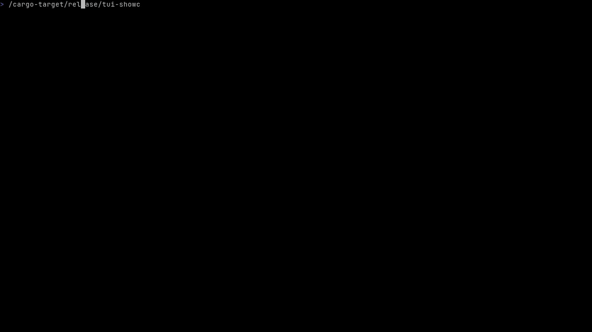

<p align="center">
  
</p>

<p align="center">
  <strong>One port. Two transports. Split directions.</strong>
</p>

<p align="center">
  A cross-platform encrypted relay that composes TLS/TCP and QUIC/UDP<br>
  independently for upload and download.
</p>

<p align="center">
  <a href="#live-operations">Live operations</a> &middot;
  <a href="#how-it-works">Architecture</a> &middot;
  <a href="#quick-start">Quick start</a> &middot;
  <a href="docs/README.md">Documentation</a> &middot;
  <a href="docs/protocol.md">Wire protocol</a>
</p>

Nowhere gives one service edge two encrypted carrier families. A local
**Vector** accepts SOCKS5 traffic; a remote **Portal** authenticates carriers,
opens targets, and relays data. Every logical flow chooses its uplink and
downlink independently instead of forcing both directions onto one transport.

| Core property | What it means |
| --- | --- |
| One service edge | TLS/TCP and QUIC/UDP share one address, port number, credential, and lifecycle |
| Split directions | Uplink and downlink independently select TLS/TCP or QUIC/UDP |
| Complete ingress | SOCKS5 CONNECT carries TCP; UDP ASSOCIATE carries UDP |
| Native chaining | A Portal can forward directly to another Portal without a loopback SOCKS5 conversion |
| Local observability | The same binary discovers running instances and renders live telemetry metrics |

## Live operations

<p align="center">
  
</p>

The built-in TUI turns every visible Portal and Vector into a live operational
view. It remains deliberately separate from process management: opening or
closing a dashboard never starts, stops, or owns a service instance.

| View | Signals and controls |
| --- | --- |
| **Overview** | Uplink, downlink, TCP, UDP, TLS, and QUIC histories; active connections; carriers; CPU and RSS where available; selected-instance metadata |
| **Logs** | Independent Access and Runtime feeds with filtering, pause and resume, paging, horizontal panning, and local privacy masking |
| **Discovery** | Automatic per-user instance discovery with stable selection and concurrent read-only viewers |

Start it from any terminal in the same user environment:

```bash
nowhere
# Equivalent explicit form
nowhere tui
```

Telemetry uses a per-user registry and a loopback control socket. It does not
consume or redirect stdout and stderr, and history is held only by connected
dashboards.

## How it works

```text
  Application
   TCP / UDP
       |
     SOCKS5
       |
       v
+--------------+   Uplink: TLS/TCP or QUIC/UDP    +--------------+
|              |=================================>|              |
|    Vector    |                                  |    Portal    |
|              |<=================================|              |
+--------------+  Downlink: TLS/TCP or QUIC/UDP   +--------------+
                                                          |
                                                  direct or SOCKS5
                                                          |
                                                          v
                                                    +------------+
                                                    |   Target   |
                                                    +------------+
```

Portal defaults to `net=mix`, accepting both carrier families on the same port
number. `net=tcp` and `net=udp` intentionally restrict the listener when an
operator wants only one carrier family.

### One flow, two transport decisions

Vector's `up` and `down` parameters form four first-class modes:

| Mode | Uplink | Downlink |
| --- | --- | --- |
| `tcp/tcp` | TLS/TCP | TLS/TCP |
| `tcp/udp` | TLS/TCP | QUIC/UDP |
| `udp/tcp` | QUIC/UDP | TLS/TCP |
| `udp/udp` | QUIC/UDP | QUIC/UDP |

TCP application traffic uses a dedicated TLS lane, an optional shared TLS Mux
stream, or a bidirectional QUIC stream. UDP application traffic uses
length-prefixed UoT over TLS or QUIC DATAGRAM. Split paths rejoin through
authenticated session and flow identity, never by source address.

## Engineered for a small data path

| Area | Design |
| --- | --- |
| Framing | 32-byte connection authentication, 5-byte flow header, one-byte setup result, and an 8-byte TLS Mux header |
| UDP overhead | 5 bytes for common QUIC DATAGRAM packets and 2 bytes for UoT packets |
| Hot path | Stack-encoded headers, binary targets, allocation-free DATAGRAM decoding, and reusable buffers |
| Reuse | Shared QUIC connections and optional, lazily opened TLS Mux shards carry many logical flows |
| Authentication | Credentials are bound to each TLS or QUIC connection through a TLS exporter |
| Resource control | Explicit bounds cover connections, streams, flows, windows, queues, reassembly, rate limits, and idle state |

Certificate reload, graceful shutdown, outbound SOCKS5, source binding,
directional rate limits, access paths, and EVENT logging are part of the core
runtime rather than external wrappers.

### Native Portal chaining

A relay Portal can terminate the incoming TLS/QUIC carrier and open the next
Nowhere flow directly with the same transport engine used by Vector:

```bash
nowhere \
  'portal://relay-key@:2077?next=origin-key@origin.example:2077&up=udp&down=udp'
```

`next` is mutually exclusive with outbound `socks`. It is lazy, so an
unavailable upstream never prevents the relay listener from becoming ready.
TCP and UDP payloads remain in the native binary flow path—there is no local
SOCKS listener, SOCKS framing, or per-packet connection setup between Portals.
Native forwarding is bounded to seven Portal hops.

## Quick start

Nowhere requires a supported Linux, macOS, or Windows target and a stable Rust
toolchain when building from source.

### 1. Build

```bash
cargo build --release --locked
```

### 2. Start Portal

The default `net=mix` mode accepts TLS/TCP and QUIC/UDP on port `2077`:

```bash
./target/release/nowhere 'portal://change-me@127.0.0.1:2077'
```

### 3. Start Vector

This Vector exposes SOCKS5 on `127.0.0.1:1080` and uses dedicated TLS/TCP lanes
in both directions:

```bash
./target/release/nowhere \
  'vector://change-me@127.0.0.1:2077?up=tcp&down=tcp&socks=127.0.0.1:1080'
```

Enable TLS Mux on both endpoints when shared Shards are desired:

```bash
./target/release/nowhere 'portal://change-me@127.0.0.1:2077?mux=1'
./target/release/nowhere \
  'vector://change-me@127.0.0.1:2077?up=tcp&down=tcp&mux=1&socks=127.0.0.1:1080'
```

To split the carriers, change the directional parameters:

```bash
./target/release/nowhere \
  'vector://change-me@127.0.0.1:2077?up=udp&down=tcp&socks=127.0.0.1:1080'
```

### 4. Inspect

Open another terminal and run:

```bash
./target/release/nowhere tui
```

## Before public deployment

The local examples omit `sni`, which disables certificate verification. A
public Portal should use a CA-trusted certificate with strict verification:

```bash
nowhere 'portal://change-me@:2077?tls=2&crt=/etc/nowhere/cert.pem&key=/etc/nowhere/key.pem'
nowhere 'vector://change-me@relay.example:2077?sni=relay.example&socks=127.0.0.1:1080'
```

Alternatively, set `pin` to the lowercase `CERT_SHA256` value printed by
Portal. Pinning takes priority over `sni` certificate-chain and name checks.
Portal and Vector use the exact configured ALPN, `now/1` by default. Set the
same nonempty `alpn` value on both endpoints when customization is required.
ALPN does not select Mux; `mux=0|1` controls TLS multiplexing explicitly.

Read the [security model](docs/security.md) before exposing a Portal outside a
trusted environment.

## Operational boundaries

| Boundary | Behavior |
| --- | --- |
| Platform | Portal, Vector, carriers, relay, TUI, and local discovery run on Linux, macOS, and Windows; Linux additionally reports process CPU and RSS |
| Visibility | Discovery is scoped to the current user's platform-specific registry and validated control endpoint |
| Ownership | The TUI is read-only and has no service lifecycle or configuration authority |
| Concurrency | Multiple TUIs may observe one instance at the same time |
| Logging | stdout and stderr remain independent from structured TUI telemetry |
| Persistence | TUI metric history and feeds begin at connection time and are not persisted |

See [Platforms](docs/platforms.md) for supported release targets, native paths,
process control, and telemetry differences.

## Documentation map

| Guide | Start here when you need to |
| --- | --- |
| [Quick start](docs/quick-start.md) | Build a local Portal and Vector |
| [Platforms](docs/platforms.md) | Review supported targets and platform-specific behavior |
| [Configuration](docs/configuration.md) | Review command URLs, defaults, identity, limits, and environment variables |
| [Operations](docs/operations.md) | Operate logs, telemetry, capacity, failure behavior, certificates, and shutdown |
| [Security](docs/security.md) | Understand trust boundaries, authentication, permissions, and resource controls |
| [Wire protocol](docs/protocol.md) | Implement authentication, flow setup, framing, and lifecycles |
| [Compatibility](docs/compatibility.md) | Understand ALPN selection and peer interoperability |
| [Integrations](docs/integrations.md) | Implement alternate clients or configure chained Portals |

## Development

Run the project checks on a supported host:

```bash
cargo fmt --all -- --check
cargo test --all-targets --locked
cargo clippy --all-targets --locked -- -D warnings
cargo build --release --locked
```

On macOS with [Apple Container](https://github.com/apple/container), the
reusable Linux check environment remains available:

```bash
./scripts/check-linux.sh
```

CI runs the project on Linux, macOS, and Windows. Release packaging covers
Linux GNU/musl on x86-64 and AArch64, macOS on Apple Silicon, and Windows
x86-64 MSVC.

Protocol changes must update the normative wire document and protocol-vector
tests in the same change.

## License

Nowhere is licensed under the [GNU General Public License v3.0](LICENSE).
Distributions of original or modified binaries must comply with the GPLv3
source and notice requirements.

---

© 2026 NodePassProject. All rights reserved.
